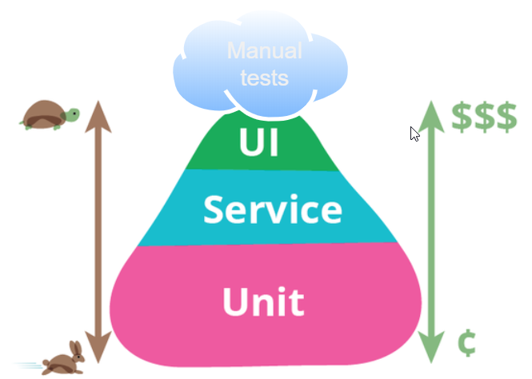

# Aula 0 - Introdução a testes em software

## Fases ou Níveis

Test Driven Development (TDD) ou Desenvolvimento guiado por testes é relacionado a conceitos de programação de Extreme Programming, iniciado em 1999. Através de TDD, programadores podem aplicar o conceito de melhorar e depurar código legado desenvolvido a partir de técnicas antigas. Existe também o Behavior Driven Development (BDD) ou Desenvolvimento Guiado por Comportamento.
### Teste de unidade (Unit testing)
É a fase em que se testam as menores unidades de software desenvolvidas (pequenas partes ou unidades do sistema).
#### Red, Green, Refactor

1. Crie testes de unidade que falhem
1. Escreva um código de produção que faça esse teste passar.
1. Limpe a bagunça que você acabou de fazer.

### Teste de integração
Garante que um ou mais componentes combinados (ou unidades) funcionam. Podemos dizer que um teste de integração é composto por diversos testes de unidade, também podemos testar com a persistência no banco de dados.

### Teste end-to-end (E2E)
Na fase de teste de sistema, o objetivo é executar o sistema sob ponto de vista de seu usuário final, varrendo as funcionalidades em busca de falhas em relação aos objetivos originais. Os testes são executados em condições similares – de ambiente, interfaces sistêmicas e massas de dados – àquelas que um usuário utilizará no seu dia-a-dia de manipulação do sistema. De acordo com a política de uma organização, podem ser utilizadas condições reais de ambiente, interfaces sistêmicas e massas de dados.

### Teste de aceitação
Geralmente, os testes de aceitação são realizados por um grupo restrito de usuários finais do sistema, que simulam operações de rotina do sistema de modo a verificar se seu comportamento está de acordo com o solicitado. Teste formal conduzido para determinar se um sistema satisfaz ou não seus critérios de aceitação e para permitir ao cliente determinar se aceita ou não o sistema. Validação de um software pelo comprador, pelo usuário ou por terceira parte, com o uso de dados ou cenários especificados ou reais. Pode incluir testes funcionais, de configuração, de recuperação de falhas, de segurança e de desempenho.

### Teste de operação
Garante que a aplicação pode rodar muito tempo sem falhar.

### Teste de regressão
Toda vez que algo for mudado, deve ser testada toda a aplicação novamente.

### Testes alpha, beta e gama
#### Alpha
O teste alpha são os testes que são feitos entre o término do desenvolvimento de uma aplicação e a sua entrega, e é feito com a observação do desenvolvedor, onde os usuários vão registrando os erros e problemas de uso da aplicação.
#### Beta
Após o termino dos testes alpha, são abertos os testes beta, onde um grupo restrito de usuários podem testar a aplicação. Geralmente o teste beta atinge um grande número de usuários, ao contrario do teste alpha esse teste geralmente é feito sem a presença do desenvolvedor. Ou seja, o teste beta é feito em um ambiente sob o qual o desenvolvedor não tem controle. Os usuários reportam os problemas encontrados na aplicação durante os testes. Com o resultado dos problemas reportados pelo usuário, os engenheiros de software fazem as devidas correções para que a aplicação possa ser disponibilizada para o mercado onde o público geral tenha acesso.
#### Gama
O gama basicamente lança produtos que foram "mal testados" ao mercado e os usuários já tem acesso a aplicação, mesmo que com muitos erros, e os problemas que os usuários encontram são corrigidos quando a aplicação já esta disponível para os usuários finais.

### Teste de Performance
Utilizando algo como Apache JMeter fazendo o sistema ir no limite que processamento de requests por segundos.
Verifica se o tempo de resposta é o desejado para o momento de utilização da aplicação.

### Teste de estresse
O teste de estresse é uma forma de teste deliberadamente intenso ou completo usado para determinar a estabilidade de um determinado sistema, infraestrutura ou entidade crítica. Envolve testes além da capacidade operacional normal, geralmente até um ponto de ruptura, para observar os resultados. Os motivos podem incluir:

* para determinar pontos de ruptura ou limites de uso seguro
* para confirmar que o modelo matemático é preciso o suficiente na previsão de pontos de ruptura ou limites de uso seguro
* para confirmar que as especificações pretendidas estão sendo atendidas
* determinar modos de falha (como exatamente um sistema falha)
* para testar a operação estável de uma peça ou sistema fora do uso padrão

### Teste de carga
Teste de carga é usado para verificar o limite de dados processados pelo software até que ele não consiga mais processa-lo. 

### Testes de Segurança
Testar a segurança da aplicação das mais diversas formas. Utilizar os diversos papéis, perfis, permissões, para navegar no sistema.

## O que vamos usar

## Referências
* https://blog.octo.com/en/the-test-pyramid-in-practice-5-5/
* https://pt.wikipedia.org/wiki/Teste_de_software
* https://blog.cleancoder.com/uncle-bob/2014/12/17/TheCyclesOfTDD.html
* https://www.portalgsti.com.br/testes-de-software/sobre/
* http://en.wikipedia.org/wiki/Stress_testing
