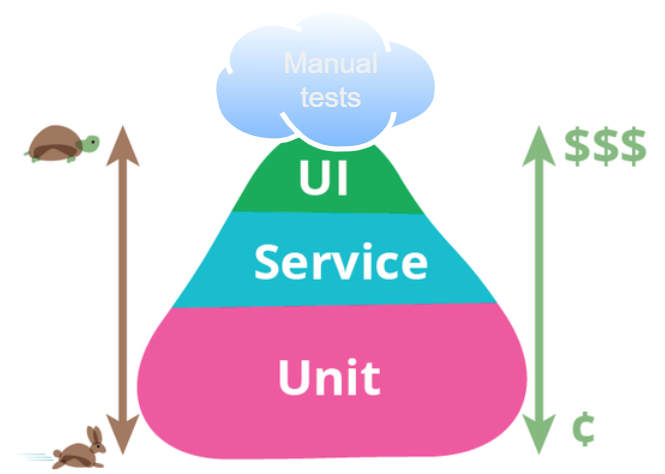

# Aula 1 - Pirâmide de teste

## Etimologia
Veio a tona por [Mike Cohn](http://www.mountaingoatsoftware.com/) em seu livro [Succeeding with Agile](https://www.goodreads.com/book/show/6707987-succeeding-with-agile?from_search=true&from_srp=true&qid=Vly36lsBNF&rank=1) de 2009. No livro, ele se refere a ela como "Pirâmide de automação de teste", mas em uso geralmente é chamada apenas de "pirâmide de teste".

## Oque é
Pirâmide de teste é uma modelo de se pensar em testes onde quando mais baixo o nivél mais rápido e barato é o teste. 
**Teste manual** que fica no topo é necessário alguém executando e verificando as saídas. 
**Teste end-to-end** ou UI, é usado provalmente o Selenium que execute o navegador e faz os assets.
**Teste de integração** ou Service, é feito com varios compomentes ou modulos exemplo banco de dados serviço interno/externo. 
**Teste unitário** ou Unit tests é testado a menor unidade possivél sem o acoplamento com outros serviços como banco de dados ou modulos.

## Indo além
O [Blog de testes do Google](http://googletesting.blogspot.co.uk/2015/04/just-say-no-to-more-end-to-end-tests.html) explica por que você não deve confiar em testes de ponta a ponta.

Adrian Sutton explica a experiência da LMAX, que mostra que os [testes de ponta a ponta podem desempenhar um papel importante e valioso](https://www.symphonious.net/2015/04/30/making-end-to-end-tests-work/).

# Referências
* https://martinfowler.com/bliki/TestPyramid.html