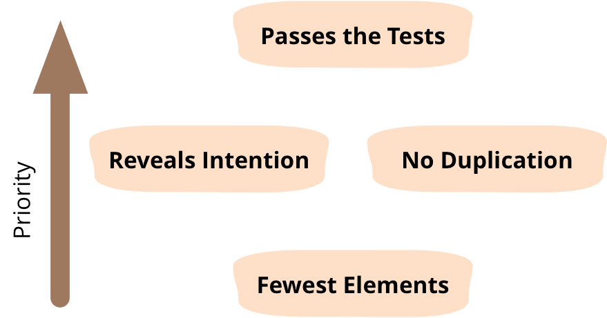

# Aula 2 - Simple Design

## Origem
Kent Beck criou suas quatro regras de design simples enquanto desenvolvia [ExtremeProgramming](https://www.goodreads.com/book/show/67833.Extreme_Programming_Explained?from_search=true&from_srp=true&qid=SkRAXl58C7&rank=1) no final dos anos 1990.

## Oque é
1. Passar todos os testes
2. Revela intenção (deve ser fácil de entender) Maximiza a Coesão
3. Sem duplicação DRY (Don't Repeat Yourself) e [SPOT (Single Point Of Truth)](http://www.catb.org/~esr/writings/taoup/html/ch04s02.html#spot_rule) Minimiza o acoplamento
4. Menos elementos (remova tudo o que não atenda às três regras anteriores)

As pessoas freqüentemente descobrem que há alguma tensão entre "sem duplicação" e "revela intenção", levando a discussões sobre a ordem em que essas regras deveriam aparecer. Martin Fowler sempre considerou a ordem deles sem importância, uma vez que se alimentam mutuamente no refinamento do código. Coisas como adicionar duplicação para aumentar a clareza costumam atrapalhar um problema, quando seria melhor resolvê-lo.

## Indo além
Essas regras, como muitas outras da Extreme Programming, foram originalmente discutidas e refinadas [no Wiki de Ward](http://c2.com/cgi/wiki?XpSimplicityRules).

# Referências
* https://martinfowler.com/bliki/BeckDesignRules.html
* https://www.theguild.nl/4-rules-of-simple-design/
* https://alvinalexander.com/misc/kent-becks-four-rules-software-simple-design/